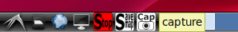
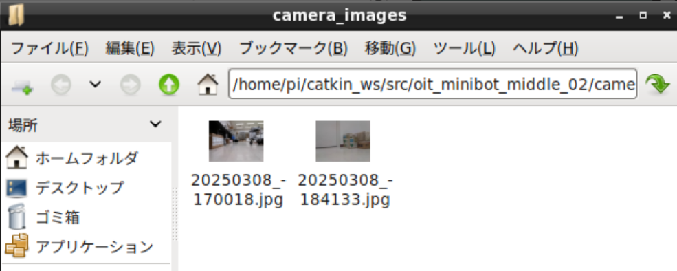
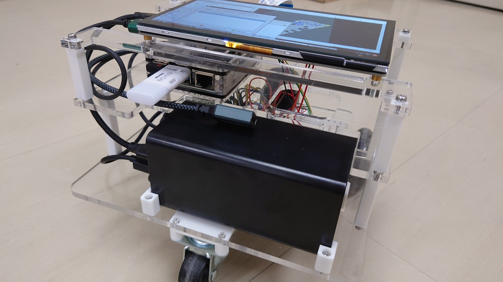
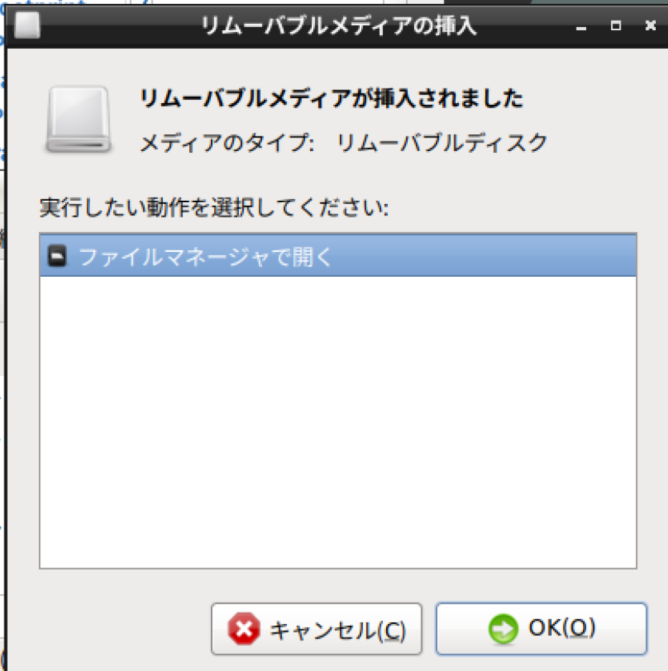
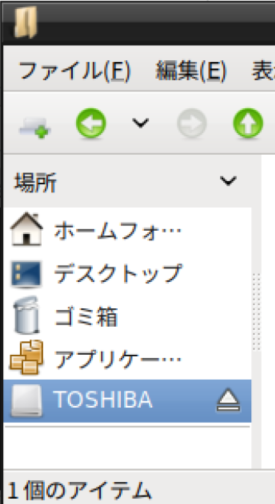
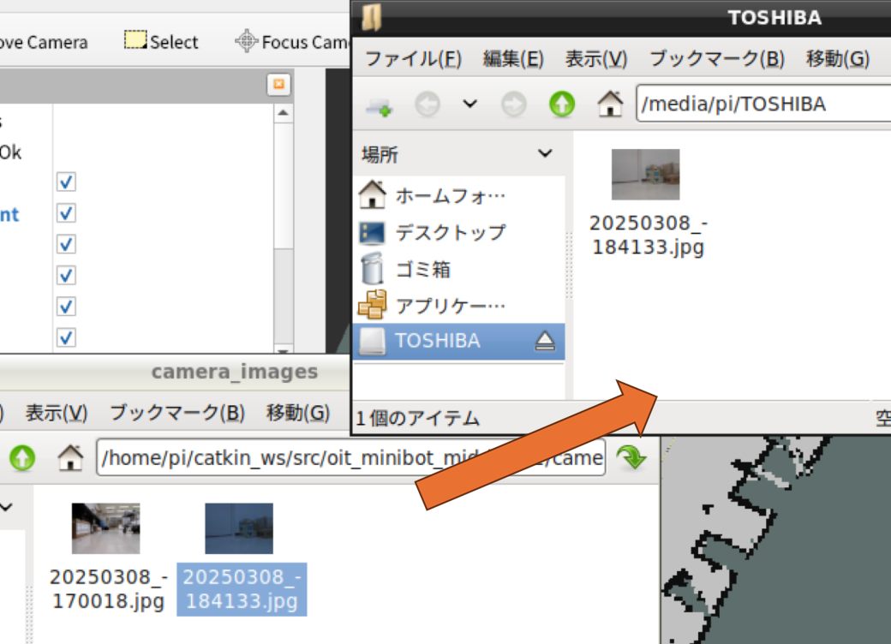
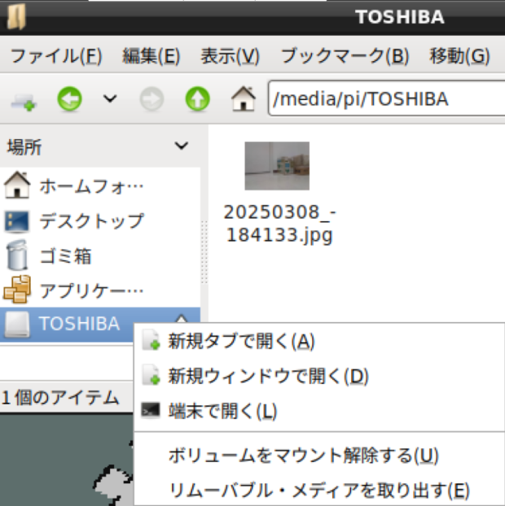

- 次 [ロボット搭載のコンピュータでシミュレータを起動する](./simulation.md)
- 前 [Linuxファイル操作の基本](./file.md)
- [トップページに戻る](../README.md)

---

# カメラ画像をキャプチャする

この操作は、[テレオペレーション](./teleop.md)、[`SLAM`](./slam.md)、[ナビゲーション](./navigation.md)のいずれかを実行中に行ってください。

`RViz`でカメラ画像が表示されていることを確認してから、デスクトップ下の方にある`Cap`（`Capture`の略）というボタンを１回クリックしてください。

メッセージが表示され、しばらくすると画像が保存されたフォルダが開きます。

## USBメモリへの画像の保存

画像は`USB`メモリで`Windows`パソコン等に移動させることも可能です。

適当な`USB`メモリを`Raspberry Pi 4`の`USB`ポートに挿入してください。
`USB`メモリの上下を間違えないように注意してください。

`Linux`デスクトップに`USB`メモリが挿入された旨の通知が表示されますので「ファイルマネージャで開く」を選びクリックしてください。

もし開かない場合はファイルマネージャを開き、`USB`メモリをクリックしてください。
ファイルマネージャの操作方法については[Linuxファイル操作の基本](./file.md)を参照してください。

画像が保存されているフォルダから、移動したいファイルを`USB`メモリにドラッグ＆ドロップすると移動できます。
また、ファイルを右クリックすることで「コピー」や「切り取りを」実行し、`USB`メモリのフォルダで右クリックして貼り付けることもできます。
このあたりの操作は`Windows`と同じです。

ファイルの移動が終わったらファイルマネージャに表示されている`USB`メモリを右クリックし「リムーバブルメディアを取り出す」を実行してから`USB`メモリを引き抜いてください。

---

- 次 [ロボット搭載のコンピュータでシミュレータを起動する](./simulation.md)
- 前 [Linuxファイル操作の基本](./file.md)
- [トップページに戻る](../README.md)
