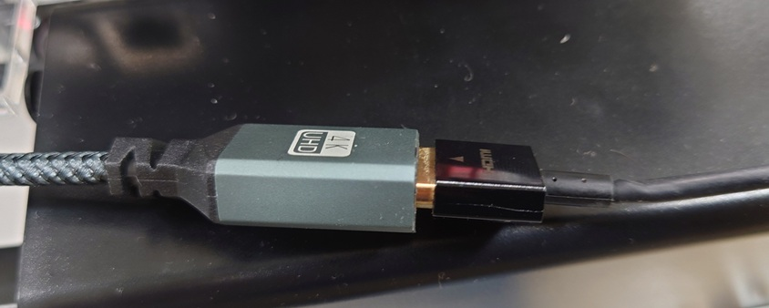
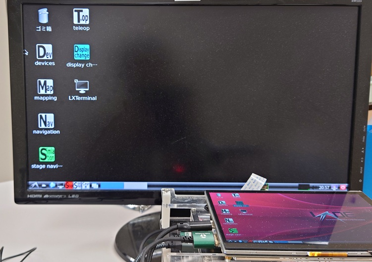
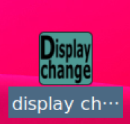
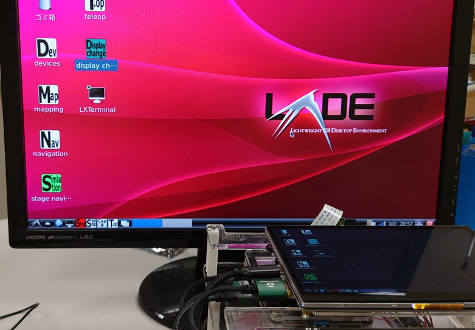

- 次 [他のソフトのインストール方法](./install_tools.md)
- 前 [ロボットのソフトをアップデートする](./docs/update.md)
- [トップページに戻る](../README.md)

---

# 外部ディスプレイの利用

ロボットに搭載している`Raspberry Pi 4`はロボット搭載の小型ディスプレイと外部ディスプレイの両方に映像を出力できます。
例えばシミュレーションとプログラミングをじっくりと行いたい場合は外部ディスプレイを使った方が効率が良い場合があります。

外部ディスプレイは`1024x600`画素の表示が可能なものを選択してください。
これはロボット搭載のディスプレイと同じ解像度です。
現状では、高解像度のディスプレイを接続しても`1024x600`画素でしか表示できません。

ロボットに接続されている`micro-HDMI->HDMI`ケーブルと外部ディスプレイの`HDMI`ケーブルを接続してください。

この時点で、外部ディスプレイに`Linux`のデスクトップが表示されます。
ただし、外部ディスプレイ側は真っ黒なデスクトップ背景になっています。

実は、このロボットは外部ディスプレイを接続していなくとも、この真っ黒なデスクトップ背景の画面を常に出力し続けています。
従って、赤い背景のデスクトップでマウスカーソルを右に移動し続けると、黒い背景のデスクトップにカーソルが移動してしまうため、外部ディスプレイを接続していなければ、マウスカーソルが見えなくなります。

外部ディスプレイを接続している場合は、黒い背景のデスクトップで作業することが可能ですが、ソフトを起動した際に常に赤い背景のデスクトップの方でウィンドウが出現するため、逐一ウィンドウを移動させる必要があり、効率が悪くなります。

そこで、デスクトップ上の`Display change`アイコンをダブルクリックします。

これにより、外部ディスプレイ上に赤い背景のデスクトップが、ロボットのディスプレイ上に黒い背景のデスクトップが表示されます。
つまり、デスクトップが入れ替わります。

これで、外部ディスプレイ上で効率よく作業をすることができます。
作業が終了したら、もう一度`Display change`アイコンをダブルクリックして、元に戻してから`HDMI`ケーブルを外してください。

この機能を活用することで、ロボットをあたかも一つのパソコンのように扱うことができます。

---

- 次 [他のソフトのインストール方法](./install_tools.md)
- 前 [ロボットのソフトをアップデートする](./docs/update.md)
- [トップページに戻る](../README.md)
