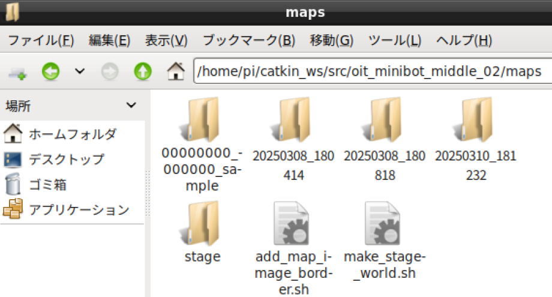
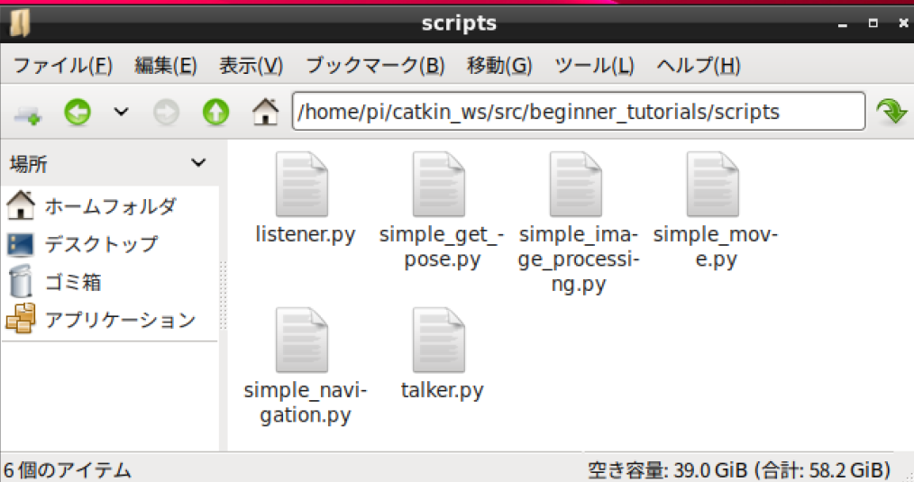

- 次 [カメラ画像をキャプチャする](./camera_capture.md)
- 前 [自律移動する（ナビゲーション）](./navigation.md)
- [トップページに戻る](../README.md)

---

# `Linux`ファイル操作の基本

ロボットの制御プログラム作成においてはプログラムのファイルだけではなく、地図や画像といった様々なファイルを扱う場合があります。
ここでは、`Linux`のファイル操作について説明します。

デスクトップの左下にある「ファイルマネージャ `PCManFM`」をクリックしてください。

次の図のようなウィンドウが開きます。

ファイルマネージャはファイルやフォルダ（ディレクトリとも呼びます）を操作するためのソフトで、`Windows`等他の`OS`でも備わっています。
図中の`/home/pi`は「パス」と呼ばれ、ファイルやフォルダの場所を示す文字列です。

`/home/pi`はコンピュータ内の`home`というフォルダ内にある`pi`というフォルダを意味しています。
詳細は省きますが、`/home/pi`はホームフォルダ、ホームディレクトリと呼ばれる特別なフォルダです。

このロボットにおける重要なフォルダの場所を覚えておきましょう。
また、ファイルマネージャでいつでもその場所を開けるようにしましょう。

`catkin_ws`⇒`src`⇒`oit_minibot_middle_02`⇒`maps`の順にダブルクリックして行ってください。

最終的には`/home/pi/catkin_ws/src/oit_minibot_middle_02/maps`というパス文字列がファイルマネージャに表示されます。
ここは`SLAM`で作成した地図が格納されます。

「ホームフォルダ」というボタンを押して`/home/pi`に戻ってください。

先ほどと同じように`catkin_ws`⇒`src`⇒`oit_minibot_middle_02`⇒`camera_images`の順にダブルクリックしてください。

ここには、搭載するカメラで撮影した写真が保存されます。

「ホームフォルダ」というボタンを押して`/home/pi`に戻り、先ほどと同じように`catkin_ws`⇒`src`⇒`beginner_tutorials`⇒`scripts`の順にダブルクリックして行ってください。

ここにはユーザが作成したプログラムを格納します。
ロボット購入時点では、サンプルプログラムが格納されています。

実際は他の場所もプログラム保存に利用できますが、慣れるまではこのフォルダを使ってください。

---

- 次 [カメラ画像をキャプチャする](./camera_capture.md)
- 前 [自律移動する（ナビゲーション）](./navigation.md)
- [トップページに戻る](../README.md)
