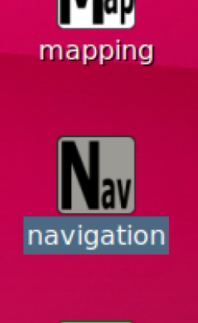
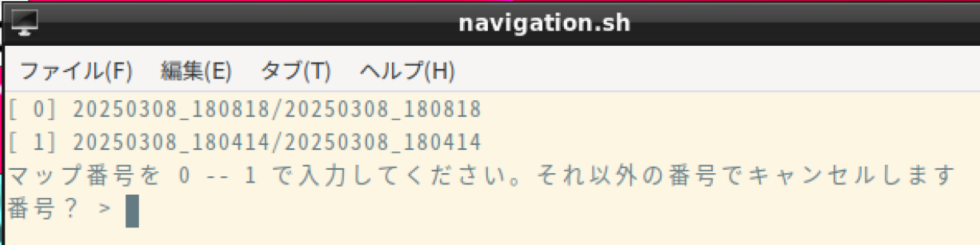
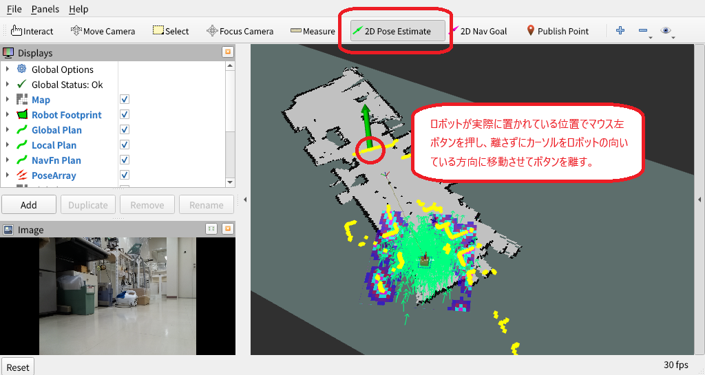
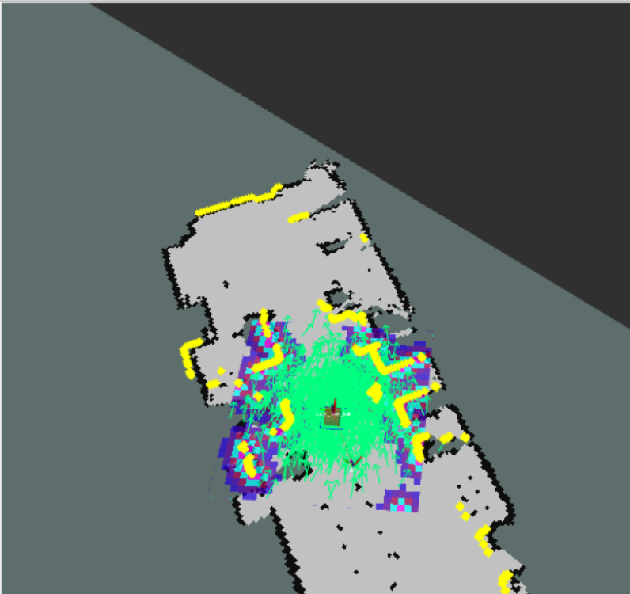
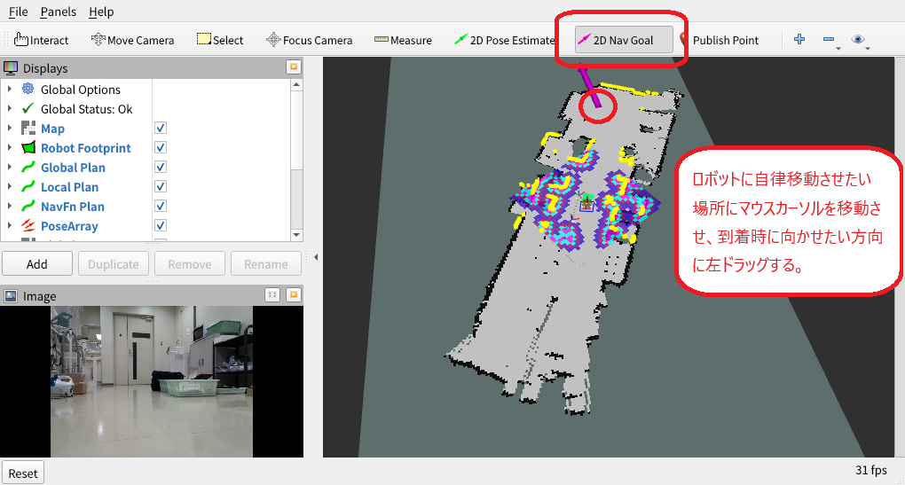

- 次 [`Linux`ファイル操作の基本](./file.md)
- 前 [地図を作る（SLAM）](./slam.md)
- [トップページに戻る](../README.md)

---

# 自律移動する（ナビゲーション）

`SLAM`で作成した地図を使い、自律移動します。

ロボットをある目的地まで自律移動させることを「ナビゲーション」といいます。
地図をとったときと同じ部屋で実施してください。
異なる部屋で実施するときは、再度地図を作成してください。

慣れるまでは、なるべく地図の作成を開始した位置の近くに地図作成開始時と同じような向きでロボットを置いて始めてください。

デスクトップ画面にある`Nav`（ナビゲーションの略）というアイコンをダブルクリックしてください。

次のように地図を選択する画面が表示されますので、使いたい地図の番号を入力してエンターキーを押してください。
`RViz`が起動します。

もともとロボットにはサンプルの地図（`00000000_000000_sample/00000000_000000_sample`）が入っていますので、地図を作成するとロボットには２つ以上の地図があることになり、このような地図選択画面が出ます。

もしもサンプル地図を削除するなどして**地図が１つだけになった場合はこの画面は出ず、直ちに`RViz`が起動します。**

起動後は大抵の場合、図のように`LiDAR`のデータ（黄色い点群）と地図上の壁の位置がずれています。
これは、ロボットが地図上での自分の位置と向いている方向を正しく認識していないことを示しています。

`2D Pose Estimate`ボタンを押し、地図上でロボットが実際に置かれている場所にマウスカーソルを移動させます。
ロボットが置かれている位置でマウス左ボタンを押し、離さずにロボットが向いている方向にカーソルを移動させてボタンを離します。
つまり、ロボットがいるはずの場所から向いている方向にマウスの左ドラッグをします。

`LiDAR`のデータ（黄色い点群）が壁（マップ上の黒い画素）におおよそ一致すれば完了です。
完全に一致する必要はありません。

その後、`2D Nav Goal`ボタンを押して、地図上でロボットを自律移動させたい場所にマウスカーソルを移動させ、到着時に向かせたい方向にマウス左ドラッグをします。

ロボットが経路を計画し、自律移動します。
場所によってはたどりつけないこともありますが、問題はありません。
少し広めの場所を目標地点にしてください。

自律移動ができることを確認したら、`Stop`ボタンを押して終了させてください。

---

- 次 [`Linux`ファイル操作の基本](./file.md)
- 前 [地図を作る（SLAM）](./slam.md)
- [トップページに戻る](../README.md)
