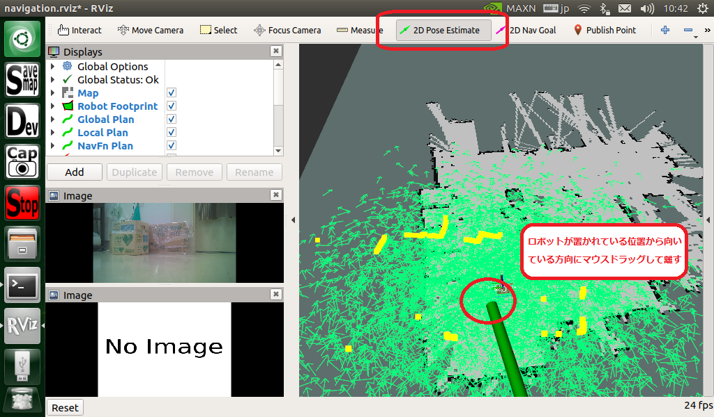
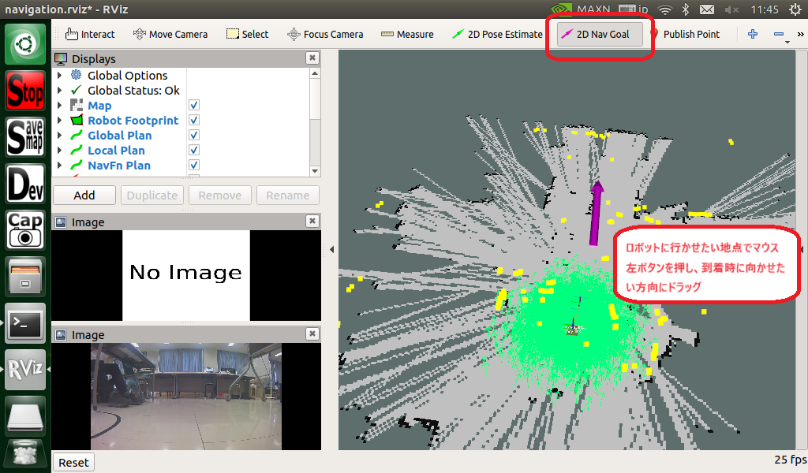

- [次に進む](./camera_capture.md)
- [前に戻る](./slam.md)
- [トップページに戻る](../README.md)

---

# 自律移動する（ナビゲーション）

`SLAM`で作成した地図を使い、自律移動します。
ロボットをある目的地まで自律移動させることを「ナビゲーション」といいます。
地図をとったときと同じ部屋で実施してください。
異なる部屋で実施するときは、再度地図を作成してください。

慣れるまでは、なるべく地図の作成を開始した位置の近くに地図作成開始時と同じような向きでロボットを置いて始めてください。

デスクトップ画面にある`Nav`（ナビゲーションの略）というボタンを１回クリックしてください。
作成した地図が**２枚以上ある場合**は次のように地図を選択する画面が表示されますので、使いたい地図の番号を入力してエンターキーを押してください。

**地図が１枚しかない場合はこの画面は出ずにすぐに`RViz`が起動します。**

図

`RViz`が起動し次の図のような画面になります。

図

起動したら`2D Pose Estimate`ボタンで自己位置推定を行ってください。

`LiDAR`のデータ（黄色い点群）が壁（マップ上の黒い画素）におおよそ一致すれば完了です。
完全に一致する必要はありません。

図

その後、`2D Nav Goal`ボタンを押して、地図上の適当な場所をクリックしてください。

ロボットが経路を計画し、自律移動します。
場所によってはたどりつけないこともありますが、問題はありません。
目的地においてマウスドラッグすることで到着時の方向を指定することができます。

自律移動ができることを確認したら、`Stop`ボタンを押して終了させてください。

---

- [次に進む](./camera_capture.md)
- [前に戻る](./slam.md)
- [トップページに戻る](../README.md)
