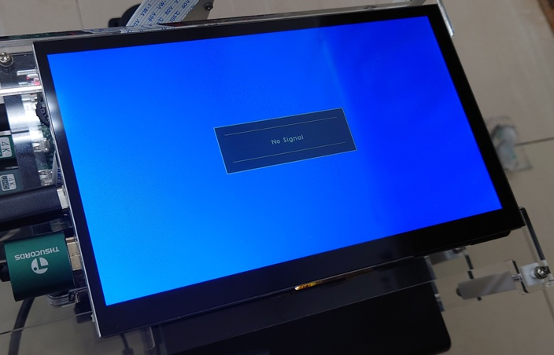
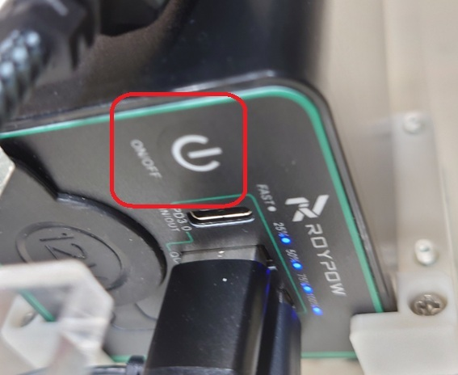
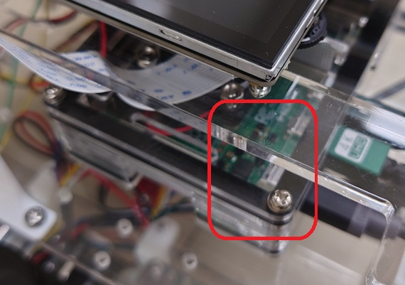
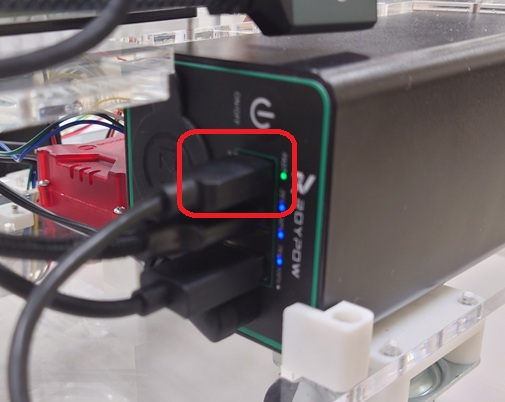

- 次 [ロボットのソフトをアップデートする](./update.md)
- 前 [サンプルプログラムを実行する](./samples.md)
- [トップページに戻る](../README.md)

---

# ロボットの電源を切り、充電する

デスクトップ左下のマークをクリックし「ログアウト」を選択してください。

その後次のような画面になりますので「シャットダウン」をクリックしてください。
なお、この画面から「再起動」や、シャットダウンの「キャンセル」も可能です。

しばらくするとディスプレイにメッセージが表示され、画面が青くなります。

放っておくと画面は真っ黒になりますが、まだ電源はオフになっていません。

バッテリーの電源ボタンを長押してください。

バッテリーの残量表示が消灯していることを確認してください。

また、`Raspberry Pi 4`の電源`LED`も消灯していることを確認してください。

この状態でロボットに付属している`USB Type-C`ケーブル付きの`AC`アダプタを使って、バッテリーの充電用`Type-C`差し込み口に接続してください。

`AC`アダプタはごく一般的な家庭用電源コンセントに接続し、ロボットのバッテリに給電してください。

ロボットを使い終えたら充電を忘れないようにしましょう。

---

- 次 [ロボットのソフトをアップデートする](./update.md)
- 前 [サンプルプログラムを実行する](./samples.md)
- [トップページに戻る](../README.md)
