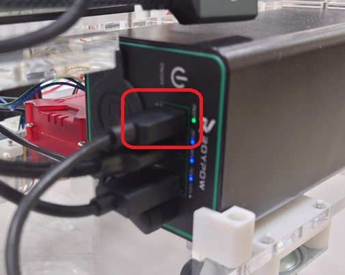
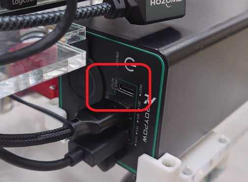
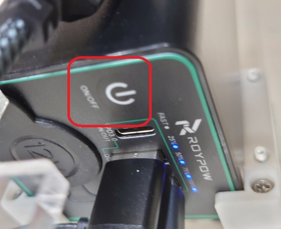
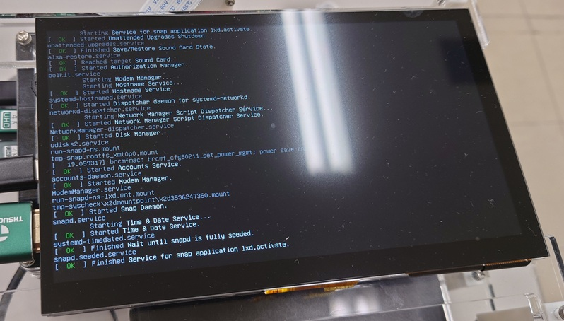
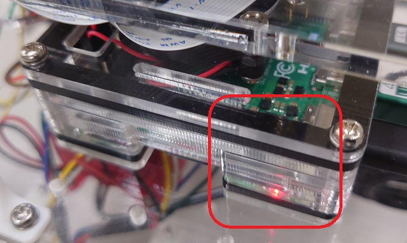
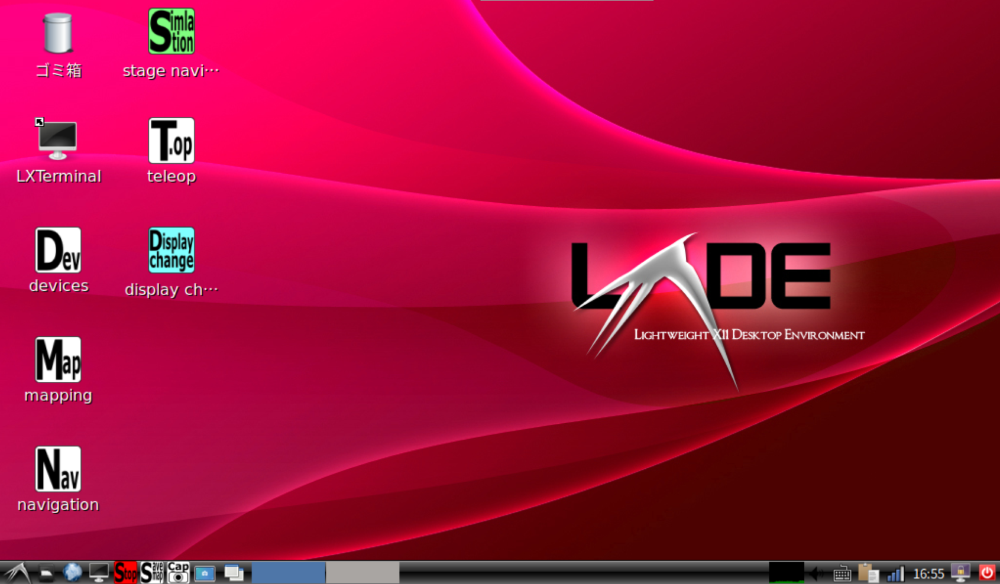

- 次 [無線LANへの接続とオンラインマニュアルの閲覧](./wifi.md)
- 前 [ロボットの構成](./structure.md)
- [トップページに戻る](../README.md)

---

# ロボットの電源を入れる

次の図のようにバッテリーに充電用の`USB Type-C`ケーブルが接続されている場合はケーブルを抜いてください。

取り外すと次のようになります。
この状態で以降の手順に進んでください。

バッテリーの電源ボタンを短く１回だけ押してください。

しばらくするとディスプレイにメッセージが表示されます。

`Raspberry Pi 4`の電源`LED`が点灯していることも確認してください。

ディスプレイが次のようになったら起動完了です。

今、ディスプレイに表示されている画面を`Linux`の「デスクトップ」といいます。
キーボードのタッチパッド部分を指でスライドし、マウスカーソルが動くことを確認してください。

もしもマウスカーソルが見えなくなった場合は、タッチパッド上で指を左の方に繰り返しなぞってみてください。
詳細は[外部ディスプレイの利用](./dual_monitor.md)をご参照ください。

---

- 次 [無線LANへの接続とオンラインマニュアルの閲覧](./wifi.md)
- 前 [ロボットの構成](./structure.md)
- [トップページに戻る](../README.md)
