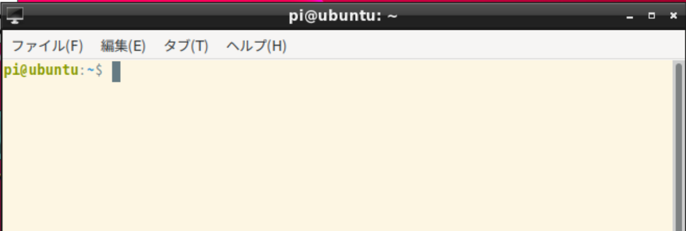
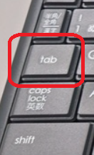
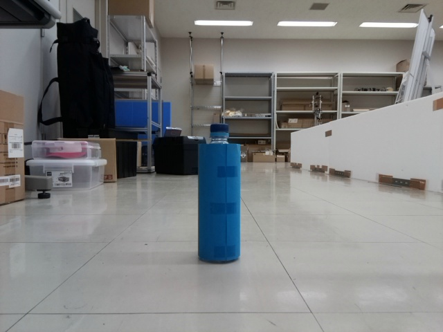
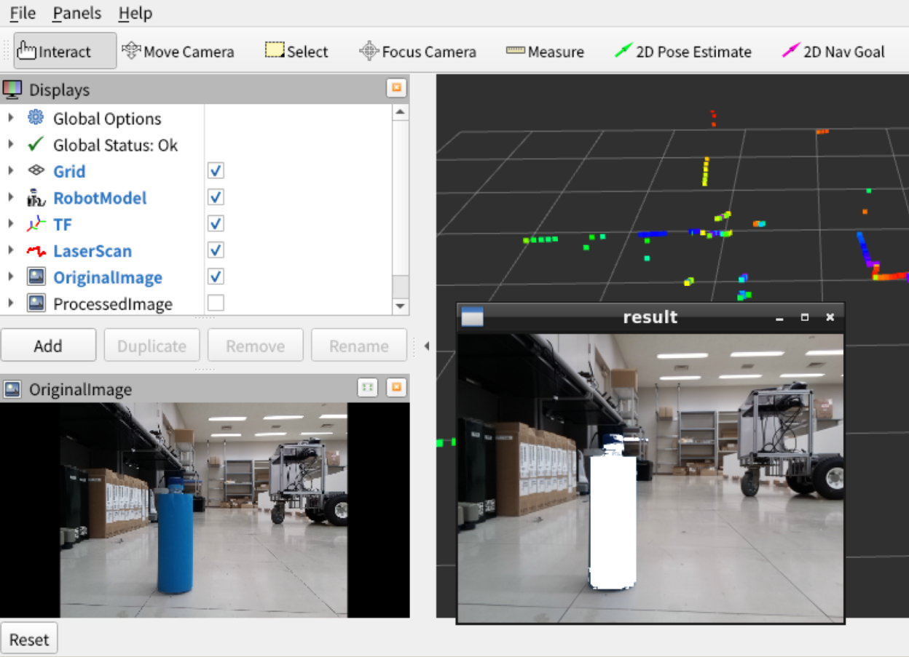
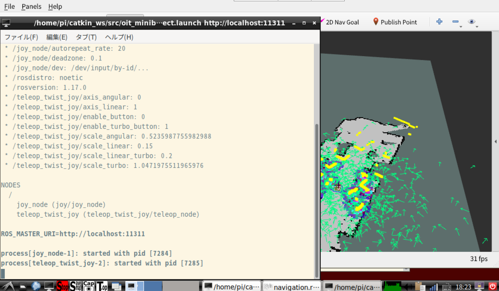
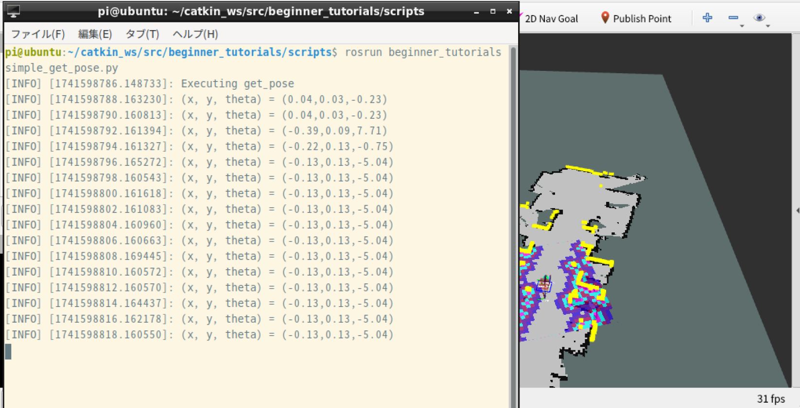
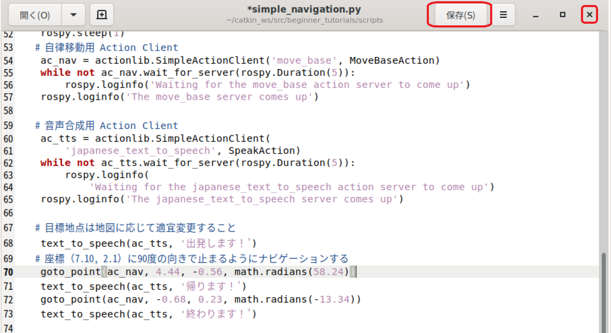

- 次 [ロボットの電源を切り、充電する](./power_off.md)
- 前 [ロボット搭載のコンピュータでシミュレータを起動する](./simulation.md)
- [トップページに戻る](../README.md)

---

# サンプルプログラムを実行する

ファイルマネージャで`/home/pi/catkin_ws/src/beginner_tutorials/scripts`を開くと、`simple_`が先頭についたファイルがいくつか存在します。
これらはサンプルプログラムです。
ロボットの制御プログラムを自作する際に参考にしてください。

## simple_move.py

単純な前進・後退・旋回と音声合成のサンプルです。

デスクトップ上の`Dev`（`Devices`の略）アイコンをダブルクリックしてください。


このアイコンはテレオペレーションからジョイスティック操作部分を除外したもので、モータコントローラや`LiDAR`、カメラ、音声合成といったロボットの最低限の機能だけを起動するものです。

つまり`Dev`アイコンで起動した状態のロボットは、基本的にはユーザが書いたプログラムで制御しないと動きません。

次にデスクトップ下の方のディスプレイマーク（`LXTerminal`）をクリックしてください。


図のようなウィンドウが出現します。



これは`Linux`を操作するための様々なコマンドを入力するためのウィンドウで「ターミナル」「端末」などと呼びます。
ターミナル上に次のコマンドを入力してください。

```shell
rosrun beginner_tutorials simple_move.py
```

ロボットで[オンラインマニュアル](./wifi.md)を開いてコピー＆ペーストしても構いませんが、次の手順でご自身で入力する方が早くて簡単です。

### Tabキーによるコマンドの補完

`Tab`キーを使うことでコマンドの補完をします。



これはある程度コマンドを入力した状態で、`Tab`キーを押すとコマンドの残りの部分が自動的に入力される機能です。

- ターミナル上で`rosr`まで入力し、`Tab`キーを押してください。`rosrun`コマンドが補完されます。`rosrun`の後ろに半角スペースが入っていることを確認してください。無ければ半角スペースを入力してください。
- `beg`まで入力し、`Tab`キーを押してください。`beginner_tutorials`が補完されます。同様に半角スペースが入っていることを確認してください。
- `sim`まで入力し、`Tab`キーを押してください。`simple_`までが補完されますので、２，３回`Tab`キーを押してください。次のように、サンプルプログラムの一覧が表示されます。

```txt
simple_get_pose.py          simple_move.py
simple_image_processing.py  simple_navigation.py
```

いくつか補完の候補がある場合は`Tab`を２，３回押すことで候補を一覧表示できます。
ターミナルには先ほどまでの入力で補完できた`rosrun beginner_tutorials simple_`が残っていますので、末尾に`m`だけを入力して`Tab`キーを押してください。

つまり、`rosrun beginner_tutorials simple_m`として`Tab`キーを押します。

これで`rosrun beginner_tutorials simple_move.py`というコマンド全てを入力できます。
一見長いように見えるコマンドでも`Tab`キーを使うことで簡単に入力できます。
`Tab`補完は`Linux`ではもちろん、`Windows`のコマンド入力でも使える必須のテクニックです。
是非習得してください。

コマンドを入力できたらエンターキーを押してください。
ロボットが音声を発信して次の動画のように動きます。
下の画像をクリックすると`YouTube`動画が再生されます。音が出るので注意してください。

[](https://youtu.be/vmrdj2cns4Q)

動作を確認したら`Stop`ボタンで全てのソフトを終了してください。


## simple_image_processing.py

カメラ画像を処理するサンプルで、画像中から青い部分を抽出します。

図のように、青い画用紙を適当な物体に貼り付けてロボットのカメラの前に置いてください。



デスクトップ上の`Dev`アイコンをダブルクリックしてください。


`simple_move.py`と同じ要領で次のコマンドを実行してください。

```shell
rosrun beginner_tutorials simple_image_processing.py
```

図のように新しいウィンドウが開き、検出された青い部分が白く塗りつぶされている画像が表示されます。



動作を確認したら`Stop`ボタンで全てのソフトを終了してください。

## simple_get_pose.py

地図上でロボットがいる座標と方向を表示するサンプルです。
このプログラムで得た座標は次に紹介する`simple_navigation.py`の修正に使えます。

[`SLAM`](./slam.md)で地図を作成した場合は[ナビゲーション](./navigation.md)の手順に従い、実際にロボットを起動してください。
まだ地図を作成していない場合は、[シミュレータ](./simulation.md)でもこのサンプルを試すことができます。
**`2D Pose Estimate`ボタンによる自己位置推定も忘れないように実施してください。**
手順を忘れた場合は[ナビゲーション](./navigation.md)を再度見直してください。

**ナビゲーション、もしくはシミュレータが起動したら**デスクトップ下の方の`T.op`（テレオペレーション）ボタンを１回クリックしてください。


しばらくすると図のようなメッセージが表示されロボットをジョイスティック操作できます。



`simple_move.py`と同じ要領で次のコマンドを実行してください。

```shell
rosrun beginner_tutorials simple_get_pose.py 
```

次のようにロボットの座標`x,y`と向き`theta`（単位：度）が表示されます。

```txt
[INFO] [1741597477.722986, 5.400000]: Executing get_pose
[INFO] [1741597479.728374, 7.400000]: (x, y, theta) = (0.04,0.03,-0.23)
[INFO] [1741597481.728677, 9.400000]: (x, y, theta) = (0.04,0.03,-0.23)
```

ジョイスティック操作するとロボットの座標や向きの値も変化します。
ロボットを座標を取得したい位置まで移動させ、表示されている値を記録してください。



なお、**自己位置が正しく推定されていない場合は出鱈目な値が出力されますので注意してください。**

動作を確認したら`Stop`ボタンで全てのソフトを終了してください。

## simple_navigation.py

地図上で指定した位置にロボットを自律移動させるサンプルです。
前述した`simple_get_pose.py`で目的地の座標と方向を２点記録しておいてください。

次のコマンドで、プログラムを修正します。
コマンドの２行目にある`gedit`とは`Windows`のメモ帳と同じ簡易なテキストエディタです。

```shell
roscd beginner_tutorials/scripts/
gedit simple_navigation.py 
```

修正箇所は`70`行目と`72`行目です。
ここでは`simple_get_pose.py`で次のような座標と向きが得られていた場合を例とします。

```txt
[INFO] [1741599447.962892]: (x, y, theta) = (-0.68,0.23,-13.34)
[INFO] [1741599495.963033]: (x, y, theta) = (4.44,-0.56,58.24)
```

この場合はプログラムを次のように修正します。
座標は`simple_get_pose.py`の出力の順序とは無関係にロボットを移動させたい順に記述します。
修正が終わったら「保存」ボタンを押してから「x」ボタンで`gedit`を終了してください。

なお、プログラム中の「出発します！」等を変更すると、ロボットの音声合成内容を変更することができます。



[`SLAM`](./slam.md)で地図を作成した場合は[ナビゲーション](./navigation.md)の手順に従い、実際のロボットを起動してください。
まだ地図を作成していない場合は、[シミュレータ](./simulation.md)でもこのサンプルを試すことができます。
**`2D Pose Estimate`ボタンによる自己位置推定も忘れないように実施してください。**
手順を忘れた場合は[ナビゲーション](./navigation.md)を再度見直してください。

起動したら、`simple_move.py`と同じ要領で次のコマンドを実行してください。

```shell
rosrun beginner_tutorials simple_navigation.py 
```

実行すると次の動画のように、指定した２カ所を順番に回ります。
下の画像をクリックすると`YouTube`動画が再生されます。音が出るので注意してください。

[](https://youtu.be/_UFydCsKZyM)

動作を確認したら`Stop`ボタンで全てのソフトを終了してください。

---

- 次 [ロボットの電源を切り、充電する](./power_off.md)
- 前 [ロボット搭載のコンピュータでシミュレータを起動する](./simulation.md)
- [トップページに戻る](../README.md)
