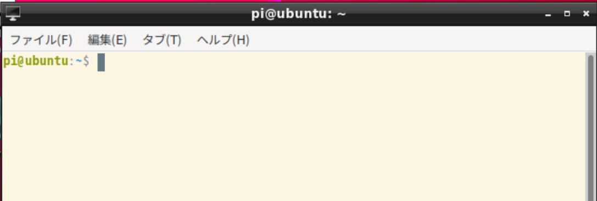
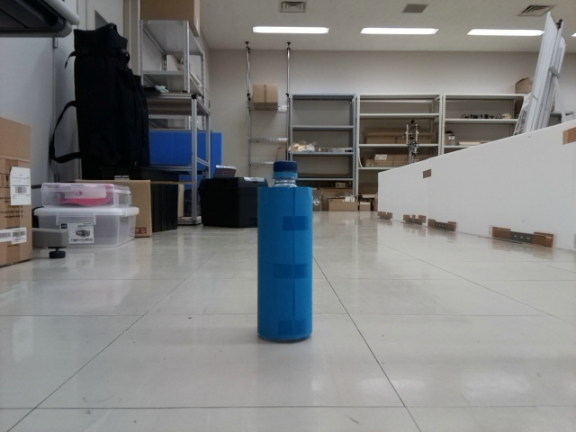

- 次 [ロボットの電源を切り、充電する](./power_off.md)
- 前 [ロボット搭載のコンピュータでシミュレータを起動する](./simulation.md)
- [トップページに戻る](../README.md)

---

# サンプルプログラムを実行する

ファイルマネージャで`/home/pi/catkin_ws/src/beginner_tutorials/scripts`を開くと、`simple_`が先頭についたファイルがいくつか存在します。
これらはサンプルプログラムです。
ロボットの制御プログラムを自作する際に参考にしてください。

## simple_move.py

単純な前進・後退・旋回と音声合成のサンプルです。

デスクトップ上の`Dev`（`Device`の略）ボタンをダブルクリックしてください。


このボタンはテレオペレーションからジョイスティック操作部分を除外したもので、モータコントローラや`LiDAR`、カメラ、音声合成といったロボットの最低限の機能だけを起動するものです。

つまり、このボタンを押した状態のロボットを動かすにはユーザが自分でプログラムを書いて実行するしかありません。

次にデスクトップ下の方のモニタマーク（`LXTerminal`）をクリックしてください。


図のようなウィンドウが出現します。



これは`Linux`を操作するための様々なコマンドを入力するためのウィンドウで「ターミナル」「端末」などと呼びます。
ターミナル上に次のコマンドを入力してください。

```shell
rosrun beginner_tutorials simple_move.py
```

ロボットで[オンラインマニュアル](./wifi.md)を開いてコピー＆ペーストしても構いませんが、次の手順でご自身で入力する方が早くて簡単です。

`Tab`キーを使うことでコマンドの補完をします。
これはある程度コマンドを入力し、`Tab`キーを押すとコマンドの残りの部分が自動的に入力される機能です。

ターミナル上で`rosr`まで入力し、`Tab`キーを押してください。
`rosrun`コマンドが補完されます。
`rosrun`の後ろに半角スペースが入っていることを確認してください。
無ければ半角スペースを入力し、`beg`まで入力し、`Tab`キーを押してください。
`beginner_tutorials`が補完されます。
同様に半角スペースが入っていることを確認し、`sim`まで入力し、`Tab`キーを押してください。
`simple_`までが補完されますので、２，３回`Tab`キーを押してください。
次のように、サンプルプログラムの一覧が表示されます。

```shell
simple_image_processing.py  simple_navigation.py
simple_move.py  
```

いくつか補完の候補がある場合は`Tab`を２，３回押すことで候補を一覧表示できます。
ターミナルには先ほどまでの入力で補完できた`rosrun beginner_tutorials simple_`が残っていますので、末尾に`m`だけを入力して`Tab`キーを押してください。
つまり、`rosrun beginner_tutorials simple_m`として`Tab`キーを押します。

これで`rosrun beginner_tutorials simple_move.py`というコマンド全てを入力できます。
一見長いように見えるコマンドでも`Tab`キーを使うことで簡単に入力できます。
`Tab`補完は`Linux`ではもちろん、`Windows`のコマンド入力でも使える必須のテクニックです。
是非習得してください。

コマンドを入力できたらエンターキーを押してください。
ロボットが音声を発信して次の動画のように動きます。

[](https://youtu.be/vmrdj2cns4Q)

動作を確認したら`Stop`ボタンで全てのソフトを終了してください。


## simple_image_processing.py

カメラ画像を処理するサンプルで、画像中から青い部分を抽出します。
図のように、青い画用紙を適当な物体に貼り付けてロボットのカメラの前に置いてください。



デスクトップ上の`Dev`（`Device`の略）ボタンをダブルクリックしてください。


`simple_move.py`と同じ要領で次のコマンドを実行してください。

```shell
rosrun beginner_tutorials simple_image_processing.py
```

図のように新しいウィンドウが開き、検出された青い部分が白く塗りつぶされている画像が表示されます。


---

- 次 [ロボットの電源を切り、充電する](./power_off.md)
- 前 [ロボット搭載のコンピュータでシミュレータを起動する](./simulation.md)
- [トップページに戻る](../README.md)
