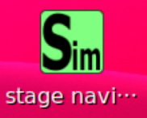

- 次 [サンプルプログラムを実行する](./samples.md)
- 前 [カメラ画像をキャプチャする](./camera_capture.md)
- [トップページに戻る](../README.md)

---

# ロボット搭載のコンピュータでシミュレータを起動する

ロボットのモータや`LiDAR`を起動することなく、シミュレーションを行うことができます。
シミュレーションは自作プログラムの動作確認を効率良く行うのに有用です。

デスクトップ上の`Sim`（`Simulation`の略）というアイコンをダブルクリックしてください。

次のように`RViz`が開きます。

デスクトップ下の方の`Stage(ROS)`と書かれたボタンをクリックしてください。

次のウィンドウが最前面に現れます。

これは`Stage`と呼ばれる簡易なシミュレータです。

`Stage`のウィンドウ上にマウスカーソルを移動させ、タッチパッド上で２本の指をスライドさせると拡大・縮小が可能です。
また、マウス左ボタンでドラッグすると、シミュレーターの表示部分をスクロールさせることができます。

拡大表示すると、次のように黒い模様といくつかの色付きの図形があることが分かります。

次の図形はシミュレートされているロボットを表しており、三角形はロボットの向きを表しています。

他の色付きの図形は、移動可能な障害物です。
マウスの左ドラッグで自由に移動させることができ、右ドラッグで回転できます。

ロボットも同様の方法で好きな場所に好きな向きで置くことが可能です。

試しに、シミュレートされているロボットの前に青い四角形を移動させてから`RViz`の画面を観察してみてください。
カメラ画像には青い物体が表示され、`LiDAR`のデータ（黄色い点群）からは目の前に障害物が検出されていることが分かります。

黒い模様は壁を表しており、移動させることはできません。
この壁は[`SLAM`](./slam.md)で生成されたものです。
`SLAM`した後に`Save map`ボタンを押すと、地図保存と同時に`Stage`用のシミュレーション設定が生成されるようになっています。

なお、地図作成をすることなくシミュレータを起動すると`/home/pi/catkin_ws/src/oit_minibot_middle_02/maps/00000000_000000_sample`に格納されている地図が使用されます。
これはサンプルですので、実際は[`SLAM`](./slam.md)の手順に従って自分がロボットを動かす環境の地図とシミュレータを作成する必要があります。

独自のシミュレータを生成した場合は、デスクトップ上の`Simulation`というアイコンをダブルクリックした際にシミュレータの選択ができるようになりますので、実行するシミュレータの番号を入力してエンターキーを押してください。

シミュレータはデスクトップ画面下の方にある`Stop`というボタンを１回クリックすれば終了できます。

---

- 次 [サンプルプログラムを実行する](./samples.md)
- 前 [カメラ画像をキャプチャする](./camera_capture.md)
- [トップページに戻る](../README.md)
