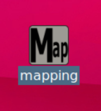

- 次 [自律移動する（ナビゲーション）](./navigation.md)
- 前 [ロボットをジョイスティックで動かす（テレオペレーション）](./teleop.md)
- [トップページに戻る](../README.md)

---

# 地図を作る（SLAM）

屋内のさほど広くない部屋（教室等）で実施してください。
体育館のように広い空間では上手くいかない可能性が高いです。

デスクトップ画面にある`Mapping`というアイコンをダブルクリックしてください。

`RViz`が起動し次のような画面になります。

３次元表示部分において、黒い部分は通行不可能な壁等の障害物、白い部分は通行可能な部分を示しています。
テレオペレーションと同じ要領でロボットを移動させてみてください。
徐々に部屋全体の壁の形が画面上に現れてきます。

部屋が大きくて地図全体が見えない場合は、３次元表示部分にマウスカーソルを移動させてからタッチパッド上に２本の指を置いて下方向にスライドさせ、縮小表示をしてみてください。

`Mapping`アイコンで起動するシステムは`LiDAR`で得られた点群をロボットの移動に合わせて重ね合わせていくような処理を行っています。
こうすることで、最終的にロボットがいる部屋全体の形を取得することができます。
これをロボットにとっての「地図」といいます。
地図はこの後に実行する自律移動において、ロボットが部屋のどこにいるかを認識するために必要になります。

このように`LiDAR`を使って地図を作ることを`SLAM(Simultaneous Localization and Mapping)`といいます。

## 地図の保存

部屋の地図を取り終わったら、デスクトップ下の方にある`Save map`というボタンを１回クリックしてください。

地図を画像として保存し、保存されたフォルダがファイルマネージャで開かれます。

なお、ファイルマネージャとはコンピュータ内のファイルやフォルダを操作するソフトです。
詳細は[Linuxファイル操作の基本](./file.md)を参照してください。

保存場所を確認したら、ファイルマネージャは閉じてください。

地図を保存したら、`Stop`ボタンを押して`SLAM`を終了させてください。

---

- 次 [自律移動する（ナビゲーション）](./navigation.md)
- 前 [ロボットをジョイスティックで動かす（テレオペレーション）](./teleop.md)
- [トップページに戻る](../README.md)
