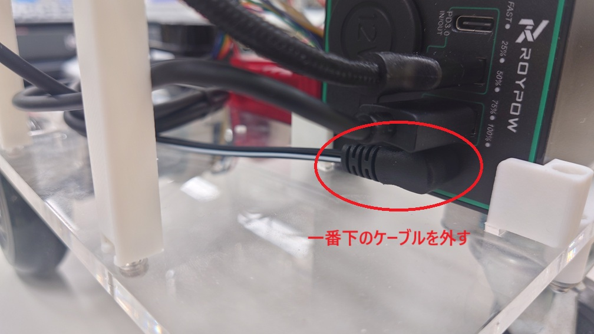
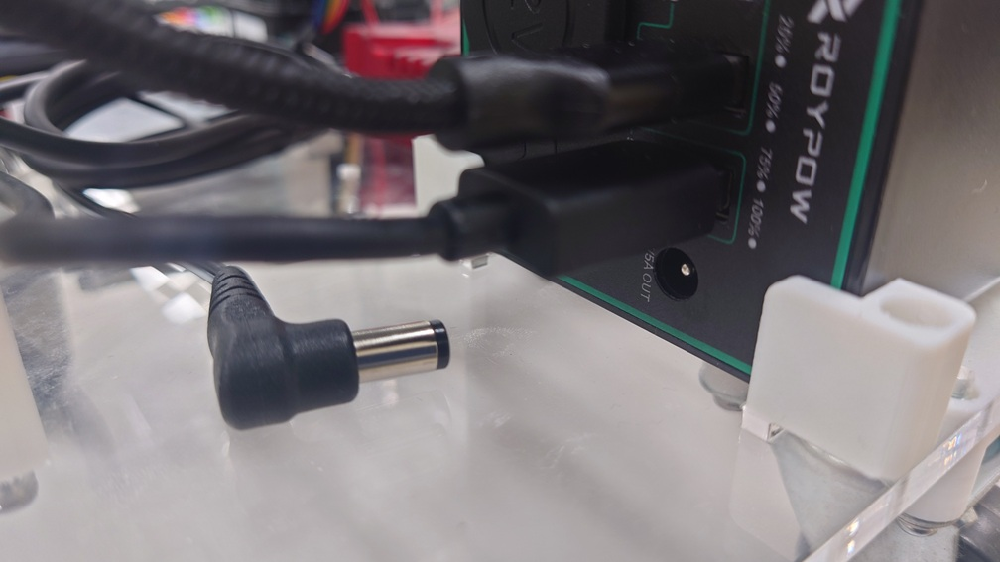

- 次 [ロボットの電源を入れる](./power_on.md)
- [トップページに戻る](../README.md)

---

# ロボットの構成

このロボットは車輪に連結された二つのモータを回転させることで、前進・後退・左右旋回を行います。
このように二つの車輪によって移動するロボットを「差動二輪型」と呼びます。

モータはモータコントローラと呼ばれる部品により速度を制御しています。
また、モータにはロータリーエンコーダというセンサがついており、車輪がどれぐらい回転したかを検出することができます。

ロボットには`LiDAR(Light Detection and Ranging)`というセンサもついています。
これはロボット周辺の障害物までの距離を計測することができるセンサです。
カメラも搭載されています。

モータコントローラや`LiDAR`等のセンサは小型コンピュータである`Raspberry Pi 4`に接続されています。

このロボットに搭載している`Raspberry Pi 4`の`OS`（オペレーティングシステム）は`Linux`の一種である`Ubuntu`です。
`OS`はコンピュータを動作させるための基本ソフトで、例としては`Windows`や`Mac OS`などがあります。

`Raspberry Pi 4`には操作用に無線キーボードが接続されています。
無線キーボードにはタッチパッドがあり、パッド上で指をスライドすればマウスカーソルが移動します。
タッチパッド下部のボタンはマウスの左右ボタンのクリックと同じように使えます。

ロボットの操作用のジョイスティックも接続されています。

また、情報提示用のスピーカ付きディスプレイも接続されています。

`Raspberry Pi 4`の中では次のような処理が行われています。

- ロボットの車体をある一定の速度で移動させるために、モータの回転数を計算し、その速度で回転するような指令をモータコントローラに送信する。
- ロータリーエンコーダが示す値を使って、車輪がどの程度回転したかを算出し、その結果に基づいて車体がどれぐらい移動したかを計算する。
- `LiDAR`やカメラ等のセンサからの情報を受け取る。

これらの処理はほんの一例です。
`Raspberry Pi 4`の最も重要な役割はユーザ（このロボットを使う皆さん）が作成したロボットの制御プログラムを実行することです。

ロボットを制御するプログラムは、前述したようなセンサからの情報を使って車体の速度を制御することが基本となりますが、ユーザの工夫次第で様々なシステムを作ることができます。

このロボットはモータやセンサ類の制御に[`ROS(Robot Operating System)`](https://www.ros.org/)を利用しています。
`ROS`はロボットの研究や開発のために世界中で利用されており、様々な便利なツール・ライブラリを含んでいます。
ユーザがプログラムを作成する際も`ROS`のライブラリを利用することで複雑なコードの記述を避けることができます。

## 緊急停止スイッチ

プログラムの誤動作等によりロボットが予期しない動きをした場合は緊急停止スイッチをロボットの後方に向けて倒しましょう。
そうするとロボットは停止します。

緊急停止させたら、ロボットのプログラムを全て終了しましょう。
画面の下の方にある`Stop`ボタンをクリックしてください。

復旧後に突然モータが回る可能性もあります。
**ロボットを広い場所に戻してから、** スイッチを前方に倒して復旧させましょう。

もしも、復旧後に何もしていないのにモータが回りだした場合は、もう一度緊急停止させましょう。
そして、画面上の`Dev`ボタンをダブルクリックしてください。

緊急停止を復旧させてもロボットが動かないことを確認し、画面の下の方にある`Stop`ボタンをクリックしてください。

まだロボットのモータが何もしていなくとも回る場合は、バッテリーからモータへ給電している一番下のケーブルを外してください。

外すと次の図のようになります。

ロボットが完全に停止していることを確認し、ケーブルを再接続して緊急停止を復旧させてください。

ロボットのすべての電力は背面に搭載されたバッテリーから供給されています。
使い終わったら[充電](./power_off.md)を忘れないようにしましょう。

## 注意事項

ロボットの電源が入っているときに車輪を強引に手で回さないようにしてください。
緊急停止時も同様です。

---

- 次 [ロボットの電源を入れる](./power_on.md)
- [トップページに戻る](../README.md)

