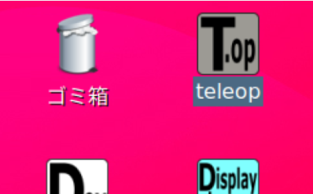
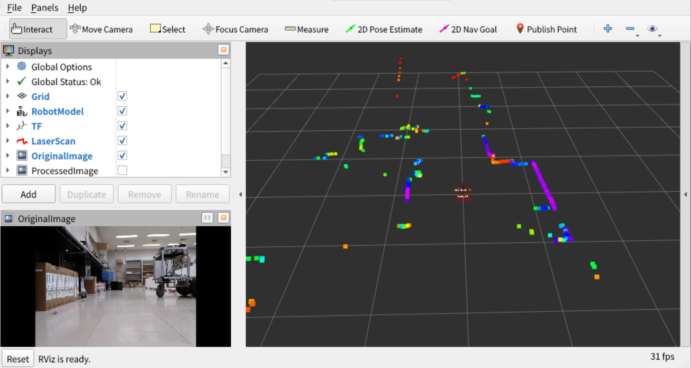
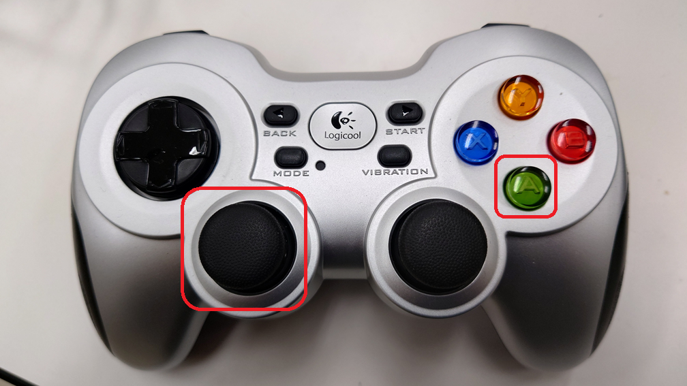

- 次 [地図を作る（SLAM）](./slam.md)
- 前 [無線LANへの接続とオンラインマニュアルの閲覧](./wifi.md)
- [トップページに戻る](../README.md)

---

# ロボットをジョイスティックで動かす（テレオペレーション）

慣れるまでは周囲に障害物が無い広い場所で実施してください。

デスクトップ画面にある`T.op`（テレオペレーション：ロボットの手動操作）というアイコンをダブルクリックしてください。

起動には少し時間がかかりますが、焦って**何回もダブルクリックしないように気を付けてください。**

画面上にメッセージが表示された後、次のような画面が表示されます。

これは`ROS`の可視化ソフト`RViz`です。
様々なセンサ情報を人間に分かりやすいように表示することができます。
左下にはカメラ画像が、右側には`LiDAR`で検出された障害物が虹色の点群で３次元表示されています。

`RViz`の３次元表示部分にマウスカーソルを移動させ、タッチパッドの左ボタンを押しながら指をスライドすると画面を様々な方向から眺めることができます。
同じく、３次元表示の部分にマウスカーソルを移動させ、タッチパッド上に２本の指を置いてスライドすると３次元表示の拡大・縮小ができます。

もしも、カメラ画像が表示されない場合は、デスクトップ画面下の方にある`Stop`というボタンを１回クリックし、ソフトを終了させてからもう一度デスクトップ上の`T.op`をダブルクリックしてください。

ジョイスティックの青のボタンを**押したまま**左レバーをゆっくり前に倒してください。

ロボットが前進します。
後ろに倒すと後退し、左右で旋回します。
レバーを斜め方向に入れると円弧を描くように動きます。

操作に慣れてきたら、緑のボタンを**押したまま**レバーを倒してください。

少し早く移動します。

終了時はデスクトップ画面下の方にある`Stop`というボタンを１回クリックしてください。

---

- 次 [地図を作る（SLAM）](./slam.md)
- 前 [無線LANへの接続とオンラインマニュアルの閲覧](./wifi.md)
- [トップページに戻る](../README.md)
