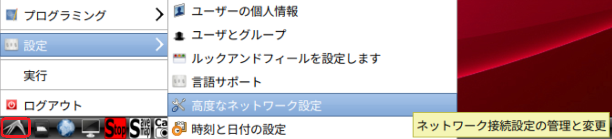
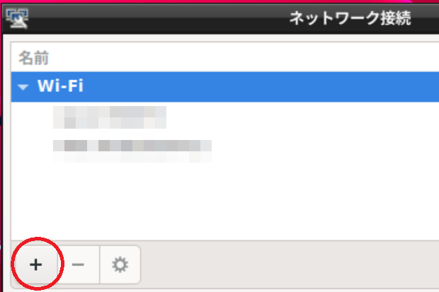

- 次 [ロボットの電源を切り、充電する](./power_off.md)
- [トップページに戻る](../README.md)

---

# 無線LANへの接続とオンラインマニュアルの閲覧

デスクトップ左下のボタンをクリックし、「設定」から「高度なネットワーク設定」を実行してください。

ウィンドウ左下の「＋」マークを押してください。

接続の種類を「`Wi-Fi`」にして「作成」をクリックします。