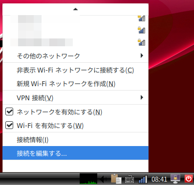

- 次 [ロボットをジョイスティックで動かす（テレオペレーション）](./teleop.md)
- 前 [ロボットの電源を入れる](./power_on.md)
- [トップページに戻る](../README.md)

---

# 無線LANへの接続とオンラインマニュアルの閲覧

デスクトップ右下のネットワーク設定のボタンをクリックし、接続したい`Wifi`をクリックしてください。

もしも、接続したい`Wifi`が見つからない場合は「その他のネットワーク」をクリックして探してください。

`Wifi`のパスワードを入力してください。
「パスワードを表示する」にチェックをしておくと、入力間違いを防げます。

しばらくすると図のようにアイコンが変化し、接続が完了します。

別の`Wifi`を追加したい場合は、接続完了を示すアイコンをクリックして同じ手順を繰り返してください。

## オンラインマニュアルの閲覧

`Wifi`に接続した状態でデスクトップ左下の`WEB`ブラウザ（地球儀のようなアイコン）をクリックしてください。

`URL`に[https://kmiyawaki.github.io/oit_minibot_middle_02/](https://kmiyawaki.github.io/oit_minibot_middle_02/)と入力してください。
ブラウザでマニュアルが開かれます。

マニュアルのアップデートに伴い、以下の図と異なる画面が表示される場合がありますが問題はありません。

マニュアルはロボット搭載のディスプレイでは画面が小さくて見にくいです。
コマンドのコピー時等、どうしても必要な場合にロボットのディスプレイで表示し、普段は`PC`やスマートフォン等の外部機器で閲覧するか[外部ディスプレイの利用](./dual_monitor.md)を参照し、別ディスプレイで閲覧することをお勧めします。

## Wifi設定の削除

一旦設定した`Wifi`を削除したい場合も、接続完了を示すアイコンをクリックしてください。

メニューが表示されますので、下の方の「▼」マーク上にマウスカーソルを移動させてください。
すると、メニューがスクロールします。

「接続を編集する」をクリックしてください。

削除したい`Wifi`を選択して、「ー」マークをクリックしてください。

---

- 次 [ロボットをジョイスティックで動かす（テレオペレーション）](./teleop.md)
- 前 [ロボットの電源を入れる](./power_on.md)
- [トップページに戻る](../README.md)
